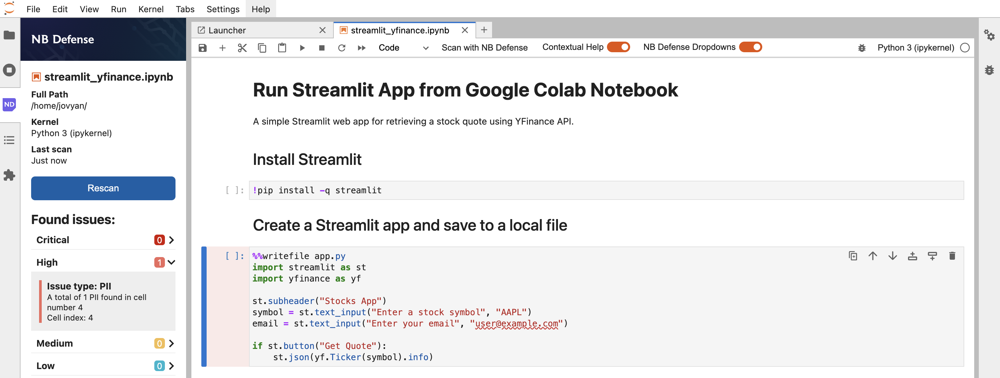

# jupyter-nbdefense
This repository deploys a JupyterLab base notebook with NB Defense extension.

[NB Defense](https://protectai.com/nbdefense), by Protect AI, is an open-source Jupyter notebook scanning tool. It is available as a CLI tool, as well as an SDK and JupyterLab Extension (JLE). It allows you to look for secrets, personally identifiable information (PII), dependency vulnerabilities, and non-permissive licenses in ML OSS frameworks, libraries, and packages. With the [JupyterLab Extension](https://github.com/protectai/nbdefense-jupyter), you can get contextual help to identify issues within your Jupyter notebook, shifting security left, and making notebook users a strong participant in the overall security program. The CLI tool, on the other hand, is intended to be inserted into Continuous Integration (CI) systems as a pre-commit hook, ensuring a secure and streamlined process.

For a detailed guide, see [this](https://alphasec.io/protect-jupyter-notebooks-with-nb-defense-extension/) post. To deploy on [Railway](https://railway.app/?referralCode=alphasec) using a one-click template, click the button below.

